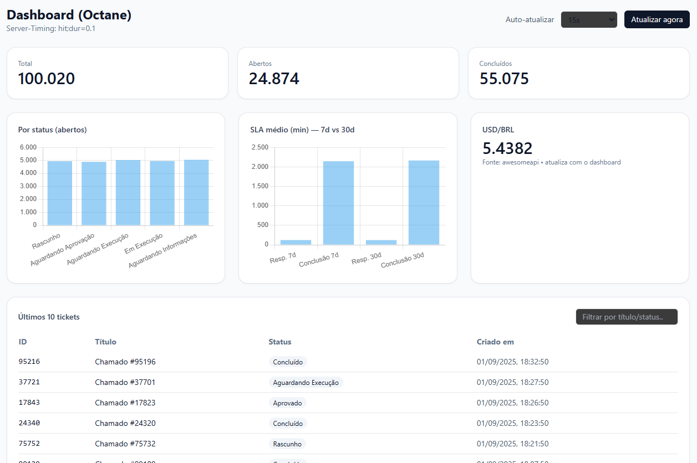

# Tickets Dashboard Octane

Dashboard de **tickets** com **Laravel 12 + Octane (Swoole)** e **Sail (Docker)**.  
KPIs calculados em **concorrência** (`Octane::concurrently`), **cache em memória** via **Swoole Table** e **aquecimento periódico**.  
Front-end (Blade + **Tailwind via CDN** + **Chart.js**), com **Server-Timing** para inspecionar tempos no DevTools.

> **Stack**: PHP 8.4 • Laravel 12 • Octane (Swoole) • Sail (Docker) • MySQL 8 • Redis • Blade • Tailwind (CDN) • Chart.js

---

## Preview

<p align="center">
  
</p>

---

## 🔗 Endpoints

- **Front**: `GET /` (e `/dashboard`)  
- **API (JSON)**: `GET /dashboard-pro`  
  Retorna: `counts`, `counts_by_status`, `sla` (7d/30d), `last10`, `usd_brl`, `generated_at`  
  Headers: `Server-Timing`, `X-Request-Id`

---

## 🚀 Rodando o projeto (passo a passo)

> Requisitos: **Docker** + **Docker Compose**

1) **Clonar & entrar**
```bash
git clone https://github.com/jeancarloscharao/tickets-dashboard-octane.git
cd tickets-dashboard-octane
```

2) **Ambiente**
```bash
cp .env.example .env
# verifique .env:
# APP_URL=http://localhost:8085
# DB_HOST=mysql
# DB_PORT=3306
# DB_DATABASE=sail
# DB_USERNAME=sail
# DB_PASSWORD=password
# MYSQL_EXTRA_OPTIONS=
# OCTANE_SERVER=swoole
```

3) **Subir MySQL e Redis**
```bash
./vendor/bin/sail up -d mysql redis
```

4) **Dependências & chave**
```bash
./vendor/bin/sail composer install
./vendor/bin/sail artisan key:generate
```

5) **Migrar banco**
```bash
./vendor/bin/sail artisan migrate
```

6) **(Opcional) Dados demo (100.000 tickets)**
```bash
./vendor/bin/sail artisan db:seed --class=DemoTicketsBigSeeder
```

7) **Subir o Octane**
```bash
# mapeado no docker-compose (ex.: 8085:8000)
./vendor/bin/sail up -d octane
```

8) **Acessar**
- Front: http://localhost:8085/  
- API:   http://localhost:8085/dashboard-pro

> Alterou código/rotas?  
```bash
./vendor/bin/sail exec octane php artisan octane:reload
```

---

## 🖥️ Front-end (Tailwind CDN + Chart.js)

- View principal: `resources/views/dashboard.blade.php`
- CSS via **Tailwind CDN**:
  ```html
  <script src="https://cdn.tailwindcss.com?plugins=forms"></script>
  ```
- Gráficos: **Chart.js** via CDN.  
- Não é necessário build de CSS/JS para desenvolvimento.  
  > Em produção, o CDN do Tailwind mostra um aviso no console — é esperado.

---

## ⚙️ Detalhes técnicos

### Swoole Table (cache em memória)
Em `config/octane.php`, garanta **uma única** seção `tables` contendo:
```php
'tables' => [
  'kpis:256' => [
    'json' => 'string:8192',
    'ts'   => 'int',
  ],
],
```
As tables são alocadas **no start** do servidor:
```bash
./vendor/bin/sail up -d --force-recreate octane
```

### Concorrência segura
- **Na requisição**: `Octane::concurrently()` para consultas/HTTP em paralelo.  
- **No boot / tick**: cálculo **sequencial** e gravação no cache (Swoole Table) para manter “quente”.

### Observabilidade
- DevTools → Network → Headers: `Server-Timing`
  - `compute;dur=…` (recalculou)
  - `hit;dur=…` (veio do cache)
- Logs:
```bash
./vendor/bin/sail logs -f octane
```

---

## 📁 Estrutura (resumo)

```
app/
  Http/Controllers/DashboardProController.php
  Services/KpiService.php
config/octane.php
resources/views/dashboard.blade.php
routes/web.php            # '/', '/dashboard', '/dashboard-pro'
routes/octane.php         # tick para aquecer KPIs (opcional)
database/seeders/DemoTicketsBigSeeder.php
docker-compose.yml
```

---

## 🧪 Testes rápidos

```bash
curl -s http://localhost:8085/dashboard-pro | python3 -m json.tool
sudo apt install -y apache2-utils
ab -n 50 -c 10 http://localhost:8085/dashboard-pro/
```

---

## 🔧 Troubleshooting

**404 em `/` ou `/dashboard`**  
→ Ver rotas em `routes/web.php`:
```php
Route::view('/', 'dashboard');
Route::view('/dashboard', 'dashboard');
Route::get('/dashboard-pro', \App\Http\Controllers\DashboardProController::class);
```
→ Limpar caches + reload:
```bash
./vendor/bin/sail exec octane php artisan optimize:clear
./vendor/bin/sail exec octane php artisan octane:reload
```

**“Swoole table [kpis] has not been configured.”**  
→ Ajuste `config/octane.php` e reinicie o serviço:
```bash
./vendor/bin/sail up -d --force-recreate octane
```

**“You’re speaking plain HTTP to an SSL-enabled server port.”**  
→ Conflito de porta do host: confirme no `docker-compose.yml` (ex.: `8085:8000`) e acesse por ela.

**Watcher (`--watch`) reclamando `chokidar`**  
→ Instale: `npm i -D chokidar` **ou** rode sem `--watch` e use `octane:reload`.

---

## 📜 Licença
MIT.
